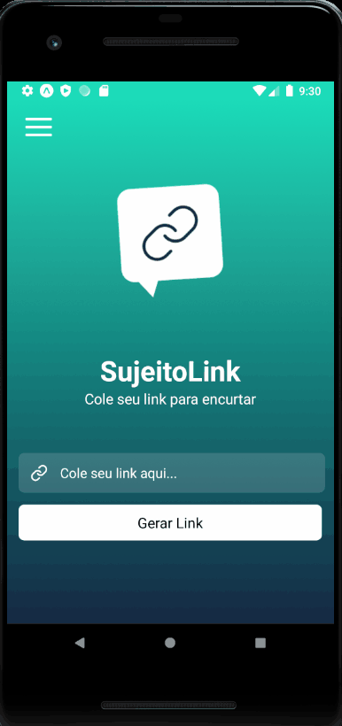
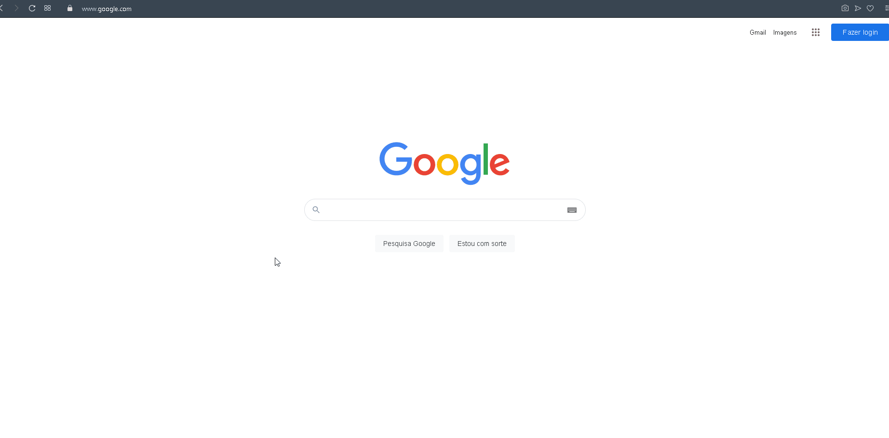

<h1 align="center"> 📱 Insider-3.0</h1>

  <a href="#sobre">Sobre</a> • <a href="#layout">Layout</a> • <a href="#techs">Tecnologias</a> • <a href="#autor">Autor</a> • <a href="#licenca">Licença</a> 

  <h2 id="sobre"> 📋 Sobre o projeto</h2>
  
Projeto que desenvolvemos durante o evento Insider do [sujeitoprogramador](https://sujeitoprogramador.com/),  aprendendo do zero a como criar um aplicativo tanto para android tanto para ios, o SujeitoLink, que quando colocamos um link ele é gerado e encurtado, para esse projeto utilizamos uma api do [Bitly](https://bitly.com/), esse evento me proporcionou muitos conhecimentos, e também foi uma experiência incrível pois nunca tinha ainda a oportunidade de conhecer essa tecnologia o react-native. Simplesmente sensacional ansioso para o próximo.

<h2 id="layout"> 🎨  Layout </h2>

<h3 align="center" display="flex">

Link encurtado funcionando:

</h3>

 <h2 id="techs"> 💻 Tecnologias</h2>
 As seguintes ferramentas foram usadas na construção do projeto:
 
-  **React-native**  - Uma biblioteca JavaScript para criar mobile Apps
-  **Styled Components**  - Biblioteca Javascript pra estilizar componentes
-   **Axios**  - Biblioteca Javascript para fazer requisições http
-  **Expo** - é uma ferramenta utilizada no desenvolvimento mobile com react native que permite o fácil acesso às API’s nativas do dispositivo sem precisar instalar qualquer dependência ou alterar código nativo.

 <h2 id="autor"> 🦸 Autor</h2>

[Wesley Wisch](https://www.linkedin.com/in/wesley-wisch)

  

<h2 id="licenca"> ⚠️  Licença</h2>

Esse projeto esta sobre a licença [MIT](https://github.com/wesleywisch/Insider-3.0/blob/main/LICENSE).